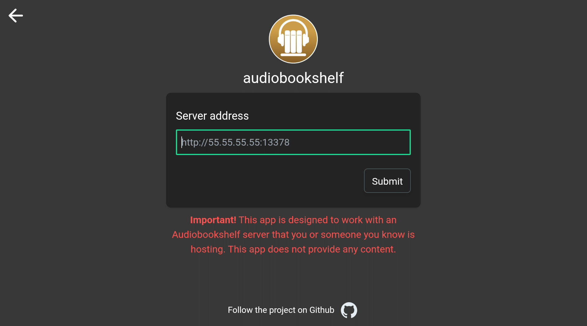
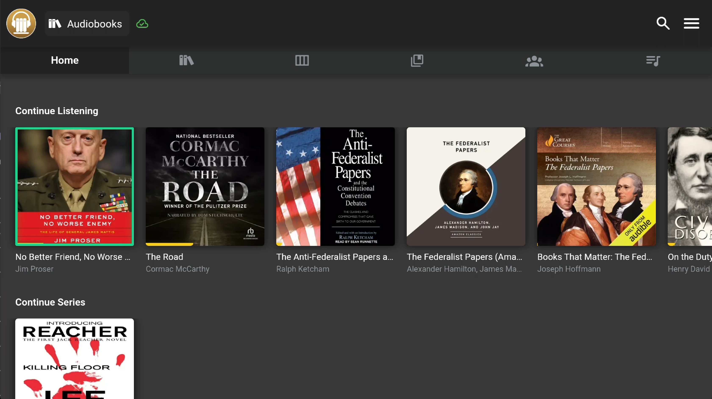
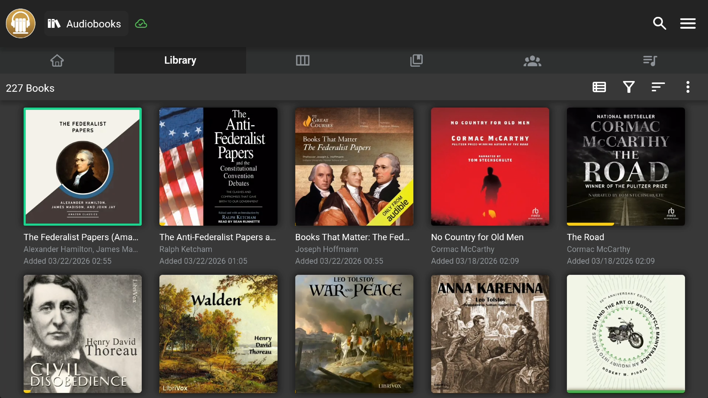
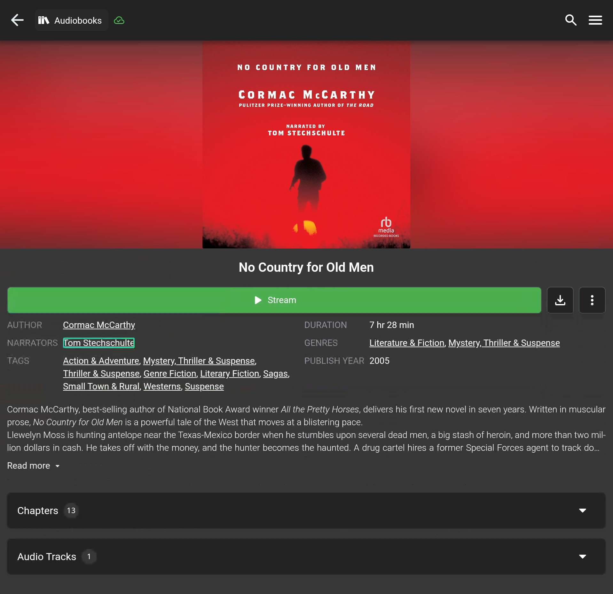
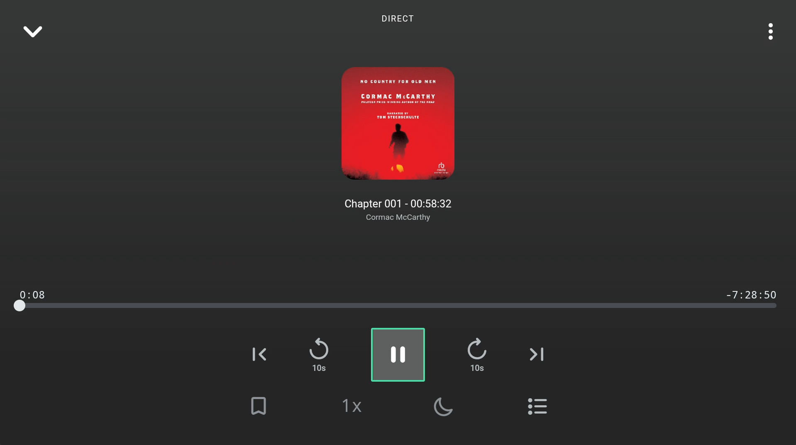
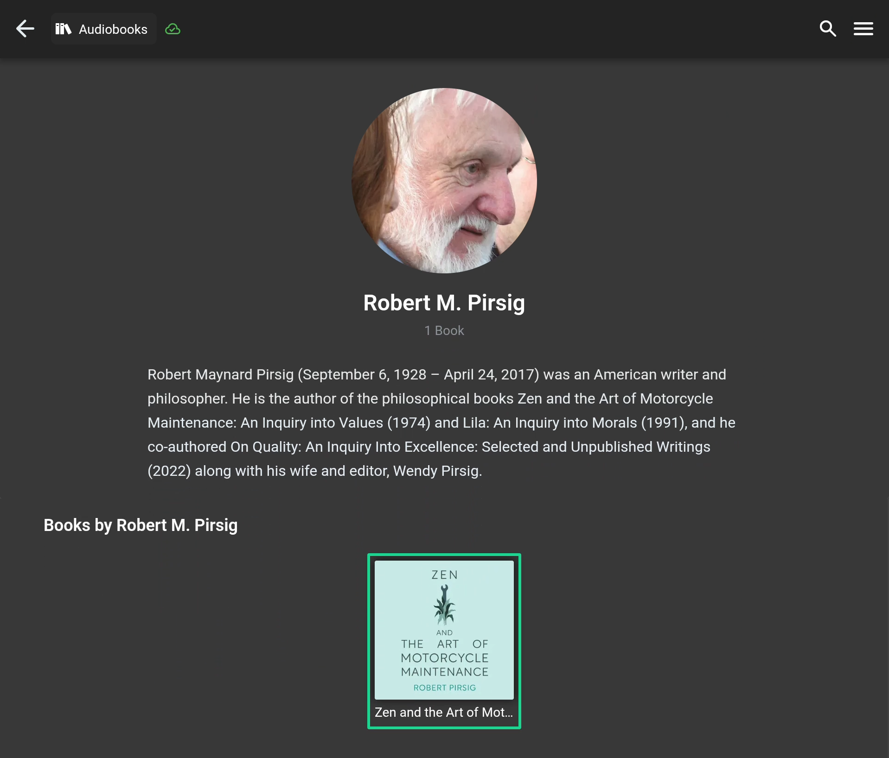
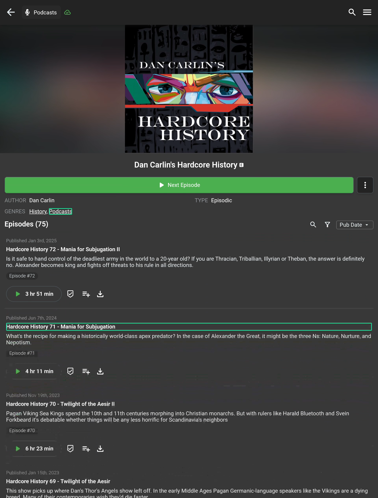

# Audiobookshelf Android TV User Guide

Audiobookshelf supports Android TV, giving you full control of your audiobook and podcast libraries from the couch using your TV remote. This guide covers everything you need to know to get started and navigate the app with a D-pad remote.

---

## Getting Started

### Installation

The TV version of audiobookshelf will be available in the Google Play Store once the app maintainer has an opportunity to publish it. 

In the meantime, you can sideload the apk located here: https://github.com/bilbospocketses/audiobookshelf-app/releases/tag/android-tv-v1.0

Once installed, the app appears in your TV launcher alongside your other apps.

### Connecting to Your Server

When you first launch the app, you'll see the server connection screen. Use the D-pad to navigate between fields:

1. **Arrow keys** move focus between the server address field, username, password, and buttons
2. **Enter/Select** activates the focused element (buttons, text fields)
3. Type your server address using the on-screen keyboard or a connected keyboard

If you have multiple servers saved, each server row is navigable — use Up/Down to select and Enter to connect.

---

## Navigation Basics

### The D-Pad Remote

All navigation uses the five standard buttons on your TV remote:

| Button | Action |
|--------|--------|
| **Up / Down / Left / Right** | Move focus between elements |
| **Enter / Select (OK)** | Activate the focused item |
| **Back** | Go back to the previous screen |

### Focus Ring

The currently focused element is highlighted with a **green border** so you always know where you are. The focus ring adapts to different element types:

- **Book/series/collection cards** — green border around the card
- **Player controls** — round green ring on circular buttons
- **Menu items and buttons** — subtle green outline
- **Modal dialogs** — green highlight on the active option

### Smart Navigation

The D-pad uses **spatial navigation** — it moves focus to the nearest element in the direction you press:

- **Left/Right** stays within the current row of cards
- **Up/Down** moves to the nearest element above or below
- The app auto-scrolls to keep the focused element visible

---

## Home Screen

The home screen shows your library shelves (Continue Listening, Recently Added, Authors, etc.). Each shelf is a horizontal row of cards.

- **Left/Right** moves between cards in a shelf
- **Up/Down** moves between shelves
- **Enter** opens the selected book, series, author, or collection

### Navigation Bar

The navigation bar at the top gives you access to all sections of the app. When you're near the top of a page, pressing **Up** moves focus to the nav bar.

| Nav Item | Description |
|----------|-------------|
| Home | Your library shelves |
| Library | Full book grid |
| Series | Browse by series |
| Collections | Your collections |
| Playlists | Your playlists |
| Authors | Browse by author |

Press **Down** from the nav bar to return to the page content.

### Side Menu (Hamburger)

Press **Enter** on the hamburger icon (☰) in the top-right to open the side drawer. This gives you access to:

- Settings
- Account
- Stats
- Logs
- Local Media
- Disconnect

Use **Up/Down** to navigate menu items and **Enter** to select. Press **Back** to close the drawer.

---

## Browsing Your Library

### Book Grid Pages (Library, Series, Collections, Playlists)

Grid pages display your content as a grid of cards.

- **Arrow keys** navigate the grid spatially
- **Enter** opens the selected item
- On the **Library** page, a toolbar at the top provides filter, sort, and view options — all accessible via D-pad. Other grid pages render with their default layout and do not have filter controls.

### Authors Page

The authors page shows a grid of author cards.

- Navigate between author cards with the **arrow keys**
- Press **Enter** to open the author detail page

---

## Book Detail Page

When you open a book, you'll see the detail page with cover art, description, chapters, and playback controls.

### Navigable Elements

Everything on the detail page is accessible with the D-pad:

- **Cover art** — press Enter to view fullscreen
- **Play button** — starts playback
- **Read More / Read Less** — expands or collapses the description
- **Chapters table** — navigate individual chapters, press Enter on a timestamp to jump to that chapter
- **Tracks table** — expand/collapse track details

### Starting Playback

Press **Enter** on the Play button. The audio player automatically opens in **fullscreen mode** on TV so you have easy access to all controls.

---

## Audio Player

The audio player is where you'll spend most of your time. On Android TV, it opens in fullscreen mode automatically when playback starts.

### Player Controls

The player has three rows of controls:

**Top Row**
- Collapse button (top-left) — minimizes the player back to the mini bar
- More options (⋮) (top-right) — access Close Player here

**Main Controls Row**
- Jump back (rewind)
- Previous chapter
- **Play / Pause** (center)
- Next chapter
- Jump forward

**Utility Row**
- Bookmark
- Playback speed
- Sleep timer
- Chapters list

Use **Left/Right** to move between controls in a row and **Up/Down** to move between rows.

### Mini Player

When you collapse the fullscreen player, a mini player bar appears at the bottom of the screen.

- Press **Down** from the page content to expand back to fullscreen
- Press **Up** from the mini player to return focus to the page

The mini player only captures focus when there are no more page elements below — so you won't accidentally jump into it while scrolling through content.

---

## Author Detail Page

The author detail page shows the author's image, biography, and a grid of their books.

- The page opens with **no initial focus** — use the D-pad to start scrolling through the biography
- When you scroll down to the books section, focus automatically transfers to the book cards
- **Up** from the first row of books scrolls back up through the biography
- **Up** when at the very top reaches the navigation bar
- Press **Enter** on a book card to open that book's detail page

---

## Podcast Episodes

Podcast detail pages show an episode list with playback controls.

- **Up/Down** navigates between episodes
- Each episode row has focusable elements:
  - **Episode title** — press Enter to open the episode detail page
  - **Play button** — starts playback immediately
  - **Playlist button** — adds to queue
  - **Download icon** — downloads the episode
- The sort control in the episode table header is also navigable
- Press **Enter** on an episode title to see the full episode detail page with description

> **Tip:** Be careful with the download button — pressing Enter will start the download immediately without a confirmation dialog.

---

## Modals and Overlays

When a modal dialog or overlay opens (e.g., libraries selector, chapter list, sleep timer), the D-pad navigation is **trapped inside the modal** — you can't accidentally navigate to elements behind it.

- Use **arrow keys** to navigate within the modal
- Press **Back** to close the modal
- Focus automatically returns to the element that opened the modal

---

## Settings and System Pages

All settings pages are fully navigable with the D-pad:

### Settings
- **Toggle switches** — press Enter to flip on/off
- **Dropdowns** — press Enter to open, arrow keys to select, Enter to confirm
- **Info icons** — press Enter to see setting descriptions

### Account
- View your account details
- Scrollable with D-pad

### Stats
- Browse your listening statistics
- Scroll through stats with Up/Down

### Logs
- View app logs
- Scroll through the log list with Up/Down
- Header buttons (copy, clear) accessible at the top

---

## Focus Memory

The app remembers where your focus was when you navigate deeper into content. When you press **Back** to return to a previous screen, focus is restored to exactly where you left off — even if the page needed to scroll back to where you were.

### How It Works

| Where You Are | What You Do | Press Back | Focus Returns To |
|---|---|---|---|
| Home | Open a book card | Back to Home | The same book card |
| Home | Open a series | Back to Home | The same series card |
| Home | Open an author | Back to Home | The same author card |
| Library | Open a book | Back to Library | The same book card (even if scrolled far down) |
| Series grid | Open a series | Back to Series | The same series card |
| Collections grid | Open a collection | Back to Collections | The same collection card |
| Playlists grid | Open a playlist | Back to Playlists | The same playlist card |
| Authors grid | Open an author | Back to Authors | The same author card |
| Author detail | Open a book | Back to Author | The same book card |
| Playlist detail | Ellipsis → History | Back to Playlist | The ellipsis button you opened |
| Book detail | Ellipsis → History | Back to Book | The ellipsis button you opened |
| Episode detail | Ellipsis → History | Back to Episode | The ellipsis button you opened |

### Overlays and Modals

When you open a modal (ellipsis menu, library selector, chapter list, sleep timer), focus is **trapped inside the modal** — you can't accidentally navigate to elements behind it. When you close the modal with **Back**, focus returns to the element that opened it.

| Trigger | Overlay Type | Close Returns To |
|---|---|---|
| Book/episode ellipsis (⋮) | More menu modal | The ellipsis button |
| Library selector | Library list modal | The library selector button |
| Hamburger menu (☰) | Side drawer | The hamburger button |

### Section Switching

When you switch between top-level sections using the navigation bar (e.g., Library → Authors → Library), focus memory is cleared for both sections. Each section starts fresh with focus on the first card, scrolled to the top. This prevents stale positions from confusing navigation.

### Server/User Screen

The server connection screen has its own focus management for TV:

| Action | Focus Behavior |
|---|---|
| Open server list | First server entry is focused |
| Add New Server | Server address input is focused, keyboard opens |
| Submit server address | Username input is focused, keyboard opens |
| Edit server address (pencil) | Server address input is re-focused |
| Back to server list | First server entry is focused |
| Delete a server entry | Focus moves to the entry above (or top entry) |

---

## Tips and Tricks

- **Quick scroll:** Press and hold an arrow key to rapidly navigate through long lists
- **Escape overlays:** The Back button always closes the topmost modal or drawer
- **Player shortcut:** From anywhere with the mini player visible, press Down when at the bottom of content to jump into the fullscreen player
- **Nav bar access:** Scroll to the top of any page, then press Up to reach the navigation bar
- **App exit:** Press **Back twice** from the home screen to bring up the exit confirmation dialog. The app fully terminates on Android TV to prevent stale state on resume.

---

## Troubleshooting

| Issue | Solution |
|-------|----------|
| No green focus ring visible | Make sure you're using a D-pad remote, not a touch/air remote in pointer mode |
| Focus seems lost | Press any arrow key — the app will recover focus to a visible element |
| Player won't open fullscreen | Press Down from the mini player bar |
| Can't reach navigation bar | Scroll to the top of the page first, then press Up |
| App shows stale data on resume | This shouldn't happen — the app terminates fully on exit. If it does, force-stop and relaunch |

---

## Reporting Issues

If you encounter navigation problems or unexpected behavior:

1. Note which page you were on
2. What button you pressed
3. What you expected vs. what happened
4. Check the Logs page (side menu → Logs) for any errors

Report issues at https://github.com/bilbospocketses/audiobookshelf-app/issues 
